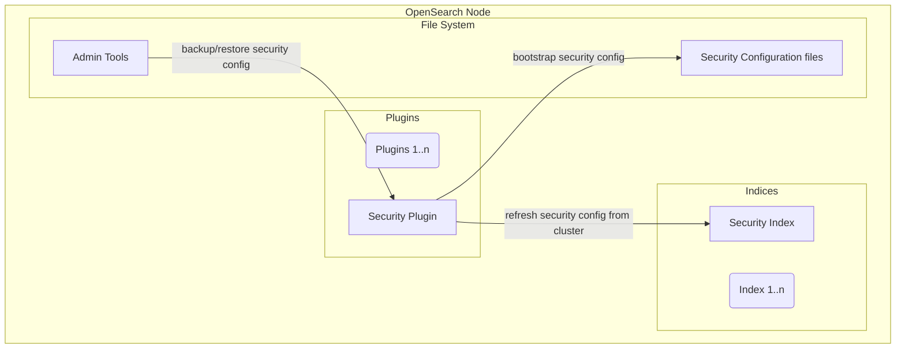
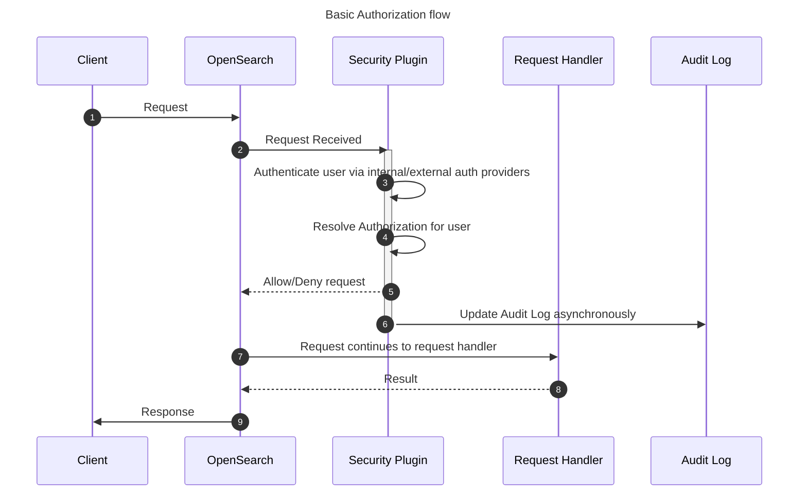
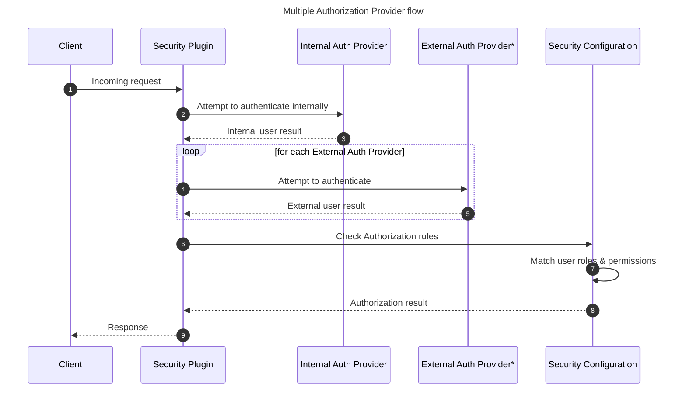
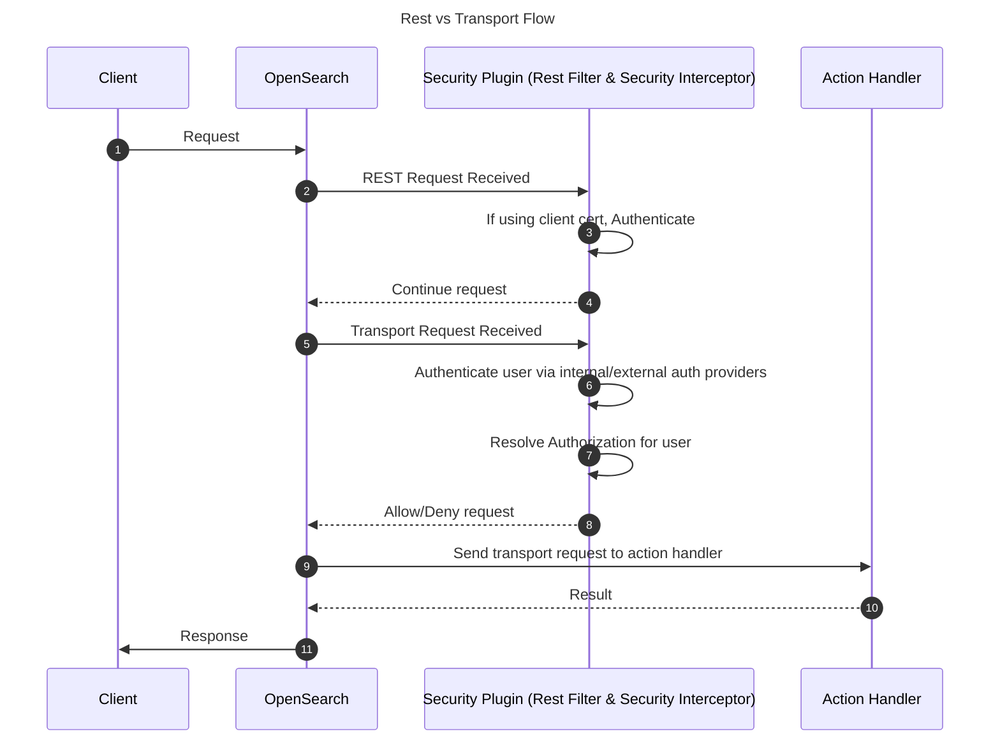
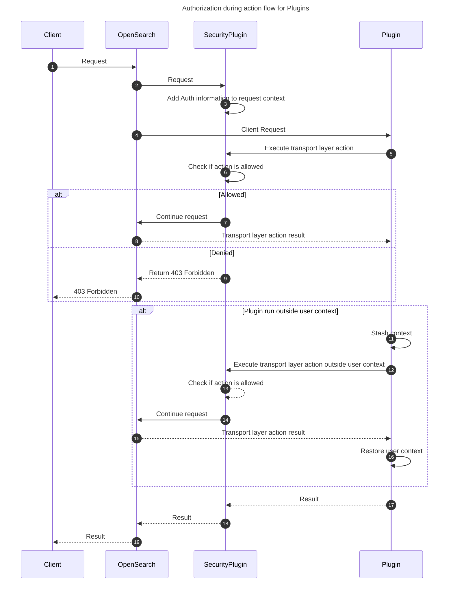
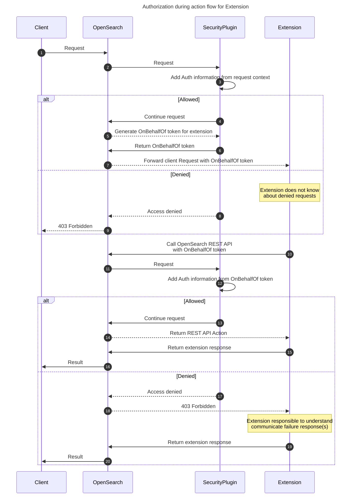
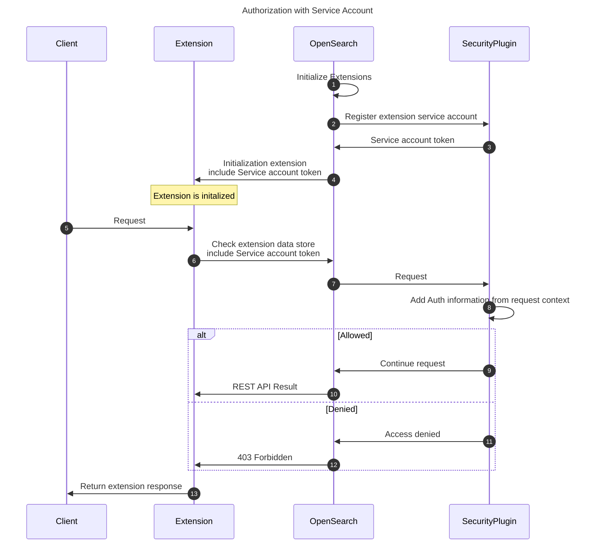

- [OpenSearch Security Plugin Architecture](#opensearch-security-plugin-architecture)
  - [Components](#components)
    - [Security Plugin](#security-plugin)
    - [Security Configuration](#security-configuration)
      - [Configuration Files](#configuration-files)
    - [Admin Tools](#admin-tools)
  - [Flows](#flows)
    - [Authentication / Authorization](#authentication--authorization)
      - [Multiple Authorization Provider flow](#multiple-authorization-provider-flow)
      - [Rest vs Transport flow](#rest-vs-transport-flow)
      - [Plugin Authorization Flows](#plugin-authorization-flows)
      - [SecurityFilter bypasses and request context](#securityfilter-bypasses-and-request-context)
      - [Extension On Behalf Of Authorization Flows](#extension-on-behalf-of-authorization-flows)
      - [Extension Service Account Authorization](#extension-service-account-authorization)

# OpenSearch Security Plugin Architecture

OpenSearch’s core systems do not include security features, these features are added by installing the Security Plugin. The Security Plugin extends OpenSearch to provide authentication, authorization, end to end Encryption, audit logging, and management interfaces.

## Components

The Security Plugin is packaged into a standard plugin zip file used by OpenSearch which can be installed by using the plugin tool. The security configuration is accessible on disk for modification before the node has been turned on.  After node startup, the admin tools or API endpoints can be used for dynamic changes.

### Security Plugin

The runtime of the Security Plugin uses extension points to insert itself into the path actions. Several security management actions are registered in OpenSearch so they can be changed through REST API actions.

### Security Configuration

The security configuration is stored in an system index that is replicated to all nodes. When a change has been made to the configuration, the Security Plugin is reloaded to cleanly initialize its components with the new settings.

#### Configuration Files

When starting up with no security index detected in the cluster, the Security Plugin will attempt to load configuration files from disk into a new security index. The configuration files can be manually modified or sourced from a backup of a security index created using the admin tools.

### Admin Tools

For OpenSearch nodes to join a cluster, they need to have the same security configuration. Complete security configurations will include SSL settings and certificate files. The admin tools allow users to manage these settings and other features.

## Flows

### Authentication / Authorization

The Security Plugin supports multiple authentication backends including an internal identity provider which works with HTTP basic authentication as well as support [external providers](https://opensearch.org/docs/latest/security/authentication-backends/authc-index/) such as OpenId Connect (OIDC) and SAML.

Authorization is governed by roles declared in the security configuration. Roles control resource access by referencing the transport action name and/or index names in combination with OpenSearch action names.

Users are assigned roles via the role mappings. These mappings include backend role assignments from authentication providers as well as internal roles defined in the Security Plugin.

#### Multiple Authorization Provider flow

Based on the order within the Security Plugin's configuration authentication providers are iterated through to discover which provider can authenticate the user.

#### Rest vs Transport flow

OpenSearch treats external REST requests differently than internal transport requests. While REST requests allow for client-to-node communication and make use of API routes, transport requests are more structured and are used to communicate between nodes.

#### Plugin Authorization Flows

Plugins that implement ActionPlugin can register REST and Transport layer handlers which can receive requests from the user and other nodes in the cluster, respectively.  During the lifecycle of an incoming requests there are two standard ways to handle authorized actions in these flows.  One us to use the authenticated user, the other is to run outside the user context.

As in the normal authorization flow into the service the user is authenticated, then the action is determined, and finally an authorization check for the user is performed, and they are allowed or denied.  This can be thought of as running on behalf of the user.

There are some actions run by plugins that do not reuse the authentication or authorization of the current user, such as to make changes to internal cluster state for cross cluster replication.  When requests come in for these actions they are run outside the user context.

> Certain system-generated requests run without an effective user and skip the normal role evaluation in `SecurityFilter`. Merely originating in a plugin or lacking user information does not guarantee this behavior. See [SecurityFilter bypasses and request context](#securityfilter-bypasses-and-request-context) for the actual conditions and context-propagation requirements.

#### SecurityFilter bypasses and request context

[`SecurityFilter`](src/main/java/org/opensearch/security/filter/SecurityFilter.java) has several early returns before normal role evaluation. These are distinct paths, not a single "system user" check. Here, **bypass** means that this invocation proceeds down the action-filter chain without reaching `PrivilegesEvaluator.evaluate`; it does not mean that authentication, transport admission, other filters, or downstream protections are disabled.

##### Which requests bypass normal role evaluation?

The following conditions are checked in order. Names below refer to the variables and constants in `SecurityFilter`.

| Path | Required conditions | Important distinction |
| --- | --- | --- |
| Superuser (`userIsAdmin`) | An effective user recognized by `AdminDNs.isAdmin` | Normally a request authenticated with a client certificate whose DN is configured as an admin DN. Having the `all_access` role is not this shortcut. Explicitly enabled injected-admin identities are another supported path. |
| Security configuration (`confRequest`) | `OPENDISTRO_SECURITY_CONF_REQUEST_HEADER` is the string `"true"`, read through `HeaderHelper.getSafeFromHeader` | A privileged internal request marker, not a public REST option. The helper accepts it only in local-node, trusted-remote-node, or direct context. |
| Internal action (`internalRequest`) | Local-cluster-node **or** direct context, and an action beginning with `internal:`, except `internal:transport/proxy` | This shortcut does not require the user to be absent. Trusted-remote-node context alone is not enough. |
| Pass-through action (`passThroughRequest`) | Action starts with `indices:admin/seq_no`, or is `WhoAmIAction.NAME` | Explicit action exceptions, not general system-context detection. |
| Local system-generated request | Origin is `LOCAL`; local-cluster-node **or** direct context; no injected roles; and no effective user | This is the userless local-request shortcut. None of these conditions alone is sufficient. |

The first four paths return before the immutable-index check. The local system-generated path comes after that check. The first group emits the explicit admin audit calls only when the admin condition is the sole matching condition; these paths do not all have identical audit behavior.

There are further exceptions inside the `user == null` branch: `cluster:monitor/state*` is allowed, and the transport compatibility settings can bypass security or inject a default transport user. Those are separate compatibility/bootstrap paths, not the definition of an internal request.

`SecurityFilter` defaults a missing origin transient to `LOCAL`. [`HeaderHelper.isDirectRequest`](src/main/java/org/opensearch/security/support/HeaderHelper.java) treats both channel type `"direct"` and a missing channel-type transient as direct. Consequently, an empty context around a local action can satisfy the local system-generated shortcut without an explicit system marker. Clearing context is therefore security-sensitive, not just a logging or cleanup operation.

##### Transients, request headers, and persistent context are different stores

"Transient header" is commonly used for a value stored with `putTransient`, but it is not a request header stored with `putHeader`. Writing a key into one store does not populate the other.

| Store | Security examples | Propagation |
| --- | --- | --- |
| `putTransient` / `getTransient` | Effective `OPENDISTRO_SECURITY_USER`, origin, channel type, local/remote-node flags, user-info summary | In-process context values. Context-aware executors can carry them between threads, but core does not serialize arbitrary transient objects over transport. Stashing normally clears them, except values retained by registered context propagators. |
| `putHeader` / `getHeader` | Serialized user/origin headers and `OPENDISTRO_SECURITY_CONF_REQUEST_HEADER` | String request headers can cross transport. The Security interceptor filters which headers it copies and explicitly serializes identity. These are not automatically trusted just because they are present. |
| `putPersistent` / `getPersistent` | `OPENDISTRO_SECURITY_AUTHENTICATED_USER` | In-process values retained across `stashContext()`. Persistence does not itself mean wire serialization: Security explicitly propagates the authenticated identity through transport headers. |

The **effective user** is the transient identity used by `SecurityFilter` for the checks above. The **authenticated user** is retained separately as the original subject. Retaining a persistent authenticated user does not prevent the local userless shortcut when the effective-user transient has been cleared.

`newStoredContext(...)` saves/restores context without resetting it to an empty context. `stashContext()` installs a reset context for a scoped operation and restores the previous one on close; it preserves persistent values and selected propagated state. They are not interchangeable. Asynchronous callbacks must restore the intended context as well.

##### Crossing a transport boundary

[`SecurityInterceptor`](src/main/java/org/opensearch/security/transport/SecurityInterceptor.java) captures identity before stashing the outgoing context. [`TransportIdentityContext`](src/main/java/org/opensearch/security/transport/TransportIdentityContext.java) then propagates it using transients for the same-node optimization, or serialized request headers for other sends (including stream transport). The receiving [`SecurityRequestHandler`](src/main/java/org/opensearch/security/transport/SecurityRequestHandler.java) restores identity and origin into the appropriate context stores and records the channel type.

Local/remote-node classification is separate from the forwarded user. The transport request evaluator checks the node-certificate request, and the handler uses the remote cluster-name header to distinguish local-cluster-node from trusted-remote-cluster context. The legacy constant names can be misleading:

- `OPENDISTRO_SECURITY_SSL_TRANSPORT_INTERCLUSTER_REQUEST` is read by `isLocalClusterNodeRequest`.
- `OPENDISTRO_SECURITY_SSL_TRANSPORT_TRUSTED_CLUSTER_REQUEST` is read by `isRemoteClusterNodeRequest`.

A trusted remote cluster is allowed through certain transport admission checks, including checks on internal/shard actions, and its context permits `getSafeFromHeader` reads. **This is not a blanket bypass of action authorization.** The `SecurityFilter` conditions in the table still determine whether normal role evaluation runs. For example, remote-node status alone satisfies neither the internal-action shortcut nor the local system-generated shortcut. A separate accepted configuration-request marker can satisfy the configuration shortcut.

These markers belong to trusted in-process/transport infrastructure. They are not knobs for REST callers: [`SecurityRestFilter`](src/main/java/org/opensearch/security/filter/SecurityRestFilter.java) sets the REST origin and rejects reserved security headers. Plugin code must not translate arbitrary client input into these markers.

##### Why user-info can be absent

`SecurityFilter` calls `createContext(...)` and then [`ThreadContextUserInfo.setUserInfoInThreadContext`](src/main/java/org/opensearch/security/user/ThreadContextUserInfo.java) **after** these early returns. That helper writes `OPENDISTRO_SECURITY_USER_INFO_THREAD_CONTEXT` with `putTransient` only if it is absent. It is a derived summary of identity, roles, and tenant access, not the identity used to authorize the request.

An admin-certificate request can therefore have an effective and authenticated user but no freshly populated user-info summary. A local system-generated request can lack both an effective user and the summary. A summary could also already be present from an enclosing context. Its presence does not prove this action passed role evaluation, and its absence does not prove that the request is internal, unauthenticated, or denied. Setting the summary manually neither authenticates a user nor grants permissions.

##### Relationship to core's system-context flag

Core exposes [`ThreadContext.markAsSystemContext()` and `isSystemContext()`](https://github.com/opensearch-project/OpenSearch/blob/5909206eb3b4fa413d584e9f634478599830386d/server/src/main/java/org/opensearch/common/util/concurrent/ThreadContext.java). **`SecurityFilter` does not read `isSystemContext()` when deciding these bypasses.** The core flag and Security's origin/identity/channel markers are not a unified system-request contract.

In the linked implementation, `markAsSystemContext()` sets the flag and rebuilds transient state through registered propagators. It retains request headers and persistent values, but it does not automatically retain all transients. It can therefore affect Security's later decisions indirectly by changing the available identity/provenance values; it is not simply a descriptive label. The flag itself is not serialized as a request header by `ThreadContext.writeTo`.

Do not replace Security's existing checks with `isSystemContext()`, or add calls to `markAsSystemContext()`, as a documentation-only cleanup. A unified contract would require auditing producers, context stashing/restoration, same-node and network propagation, user-initiated child actions, admin identities, and cross-cluster requests, with compatibility tests for each.

For plugin authors: preserve the caller's effective identity for work performed on their behalf. Use a narrowly scoped, reviewed elevated execution path only where needed, and restore the previous context afterward. [`SecurePluginSubject.runAs`](src/main/java/org/opensearch/security/identity/SecurePluginSubject.java), for example, stashes context but installs a plugin user; it is not the same as the no-effective-user shortcut described above.

#### Extension On Behalf Of Authorization Flows

Extensions will be able to operate in similar flows as Plugins to ensure authorization is correctly handled.  Registration of REST handlers is allowed and transport layer actions are not permitted.  After the request has been authorized for the user to be transmitted to the extension the token generator will create a just in time token for use with that request on behalf of the user.

> On Behalf Of tokens are an optional feature, while supported through the extensions API it needs to be enabled on an individual extension basis.  Issuing On Behalf Of tokens can be disabled which will alter request forward to the extension not to include the On Behalf Of token.

#### Extension Service Account Authorization

Service account information is provided to the extension on initialization.  This allows extension to make requests against the OpenSearch Cluster without needing an incoming request.  Since this request is down in the context of a different identity it can have different permissions from that of an On Behalf Of user such as modification to a persistent data store used by the extension.

